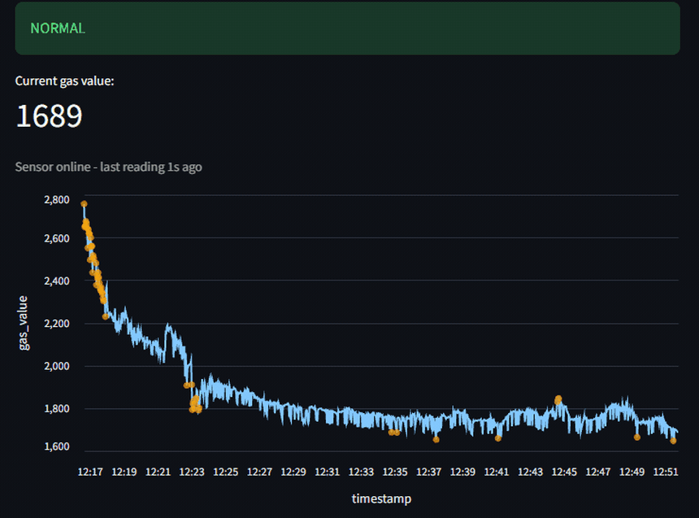
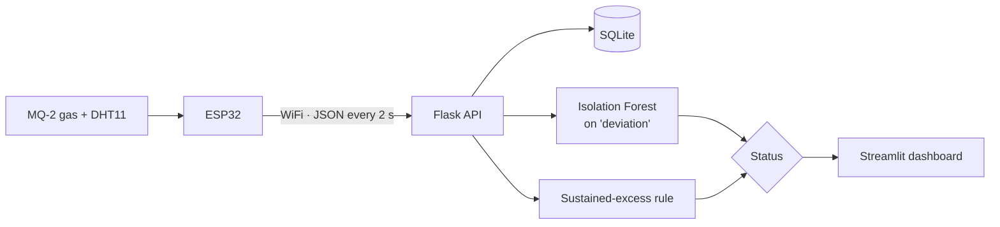

# Smart Gas Guardian

**Most gas alarms trip at a fixed number. This one scores every reading against its own
recent baseline** — so it adapts to cooking, ventilation and a drifting sensor instead of
needing a threshold set for it.

Threshold-free kitchen gas-leak detection: an ESP32 + MQ-2 streams to a Flask service that
turns every reading into a rolling z-score, flags the outliers with an Isolation Forest,
backs that with a sustained-elevation rule, and shows the verdict on a live dashboard.



*Gas opened next to the sensor for ~30 s. `WARNING` (model) fires within ~3 s of the rise,
`ALERT` (rule) ~20 s in once the elevation is sustained — and `ALERT` stays on through the
decay tail after the gas is shut off, where the model has already gone quiet. Sped up ~3×.*

---

## How it works



The ESP32 reads the MQ-2 (analog, GPIO34) and a DHT11 every 2 seconds and POSTs a small JSON
payload to the Flask backend. The backend stores every reading in SQLite and, on each one,
produces two independent signals. The dashboard turns those into a single **NORMAL /
WARNING / ALERT** state, a live chart with the flagged points marked, and a sensor
online/offline check.

## Detection approach

A fixed threshold ("alarm if the reading passes X") doesn't work here. The MQ-2's baseline is
not stable — measured in the quiet early-morning window, the clean-air reading drifted from
~1000 to ~2470 over about two weeks while the temperature barely moved. The sensor's own
resistance wanders with age, humidity and season. Any absolute threshold would either
false-alarm constantly or miss a real leak, depending on the week.

So the system uses two relative signals instead:

**1. `deviation` → Isolation Forest.** Each reading becomes
`deviation = (reading − rolling_mean) / rolling_std` over the last ~5 minutes — a rolling
z-score that asks "how far is this from the last few minutes?" It re-references itself
continuously, so it doesn't matter what the absolute baseline is or how far it has drifted.
An unsupervised Isolation Forest (`contamination = 0.03`), re-trained hourly, learns the
distribution of `deviation` from the collected data and flags the tails.

To be precise about what the model does: with a single feature the Isolation Forest is close
to a data-calibrated threshold on that z-score — it is not learning a multi-dimensional
"shape" of normal. What it adds over a hand-picked cutoff is that it sets the boundary itself
from the real, asymmetric distribution (gas spikes up more than it dips down) and keeps it
calibrated as more data arrives. Temperature, humidity and time-of-day were tested as extra
features and dropped: the baseline drift makes them unreliable and they barely moved the
results. A natural next step would be more *relative* features that are also drift-safe —
rate of change, ratio to a longer baseline — which would give the model genuine multivariate
structure to learn.

**2. Sustained-excess rule.** The model catches a *sudden* spike instantly but stops flagging
~30 seconds later once the rolling mean catches up — a slow or plateauing leak can slip
through. The rule covers that gap: it fires when the current reading is above **1.3×** a slow
baseline (median of the last 1000 readings) **and** at least 8 of the last 10 readings are
also above it (sustained ~20 s). The baseline is relative, so it follows the sensor drift on
its own.

Together: the model is the fast, sensitive early warning (**WARNING**); the rule is the
high-confidence "this is real and persistent" signal (**ALERT**).

## Stack

| Layer | Tech |
|---|---|
| Hardware | ESP32, MQ-2 gas sensor (Flying Fish module), DHT11 temperature/humidity |
| Firmware | Arduino / C++ — `WiFi`, `HTTPClient`, `DHT` |
| Backend | Python, Flask, SQLite |
| ML | scikit-learn (Isolation Forest), pandas, NumPy |
| Dashboard | Streamlit, Altair |

## Running it

The backend and the ESP32 must be on the same local network.

```bash
# 1. Environment
python -m venv venv
venv\Scripts\activate            # Windows;  source venv/bin/activate on Linux/macOS
pip install -r requirements.txt

# 2. Flash the ESP32
#   - copy  mq2_reader/secrets.h.example  ->  mq2_reader/secrets.h
#     and fill in WiFi SSID/password and the backend machine's IP
#   - open  mq2_reader/mq2_reader.ino  in Arduino IDE
#     Board: "ESP32 Dev Module"  ->  Upload
#   - Serial Monitor at 115200 baud shows the ~2 min sensor warm-up, then live readings

# 3. Run the backend and the dashboard (two terminals)
python backend.py                # Flask on :5000, stores readings, runs the model hourly
streamlit run dashboard.py       # live dashboard
```

`train_model.py` is a separate evaluation script — walk-forward validation of the model over
the collected data, printing the flag rate per window. It does not train the production model
(the backend does that in memory at startup and re-trains every hour).

## Results

From ~4 weeks of continuous collection and three controlled gas-release tests (sensor held
next to an **unlit** burner, gas open ~30 s, window open):

- **Clean-air baseline:** ~2100–2900 raw ADC over the test period and drifting upward — this
  is why the detection is threshold-free.
- **Gas release:** reading rose to 3300–4095 (sensor saturation) within ~15 s.
- **`is_anomaly`** (model) triggered within ~2 s of the rise.
- **`rule_alert`** triggered ~19 s into the sustained elevation and stayed on through the
  ~40 s decay tail *after* the gas was shut off — the exact window the model alone misses.
- **False positives:** zero `rule_alert` on normal air across all three tests.
- **Walk-forward flag rate** on held-out normal data: ~1.3–1.6%, comfortably under the 3%
  the model is told to expect — it is not over-firing on unseen data.

## Known limitations

- A leak lasting more than ~15 minutes slowly pulls the slow baseline up and `rule_alert`
  stops firing. Fine for a demo; would be fixed by excluding the most recent ~30 minutes
  from the baseline window.
- Each gas exposure raises the baseline a little and it does not fully recover (MQ-2
  hysteresis), so repeated tests compound it. A baseline that drifted high enough would push
  the `1.3×` threshold past the sensor's saturation point (4095). Neither showed up in normal
  operation over the test period; a `baseline + fixed offset` threshold would remove the risk.
- The MQ-2's ~2 minute warm-up after power-on is not yet surfaced in the dashboard — the
  first readings after a restart can look anomalous.
- Alerting is the dashboard state only; there is no push notification channel yet.
- The backend IP is assigned by DHCP; `mq2_reader/secrets.h` has to match it.
- Single sensor, single room.
